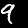
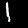
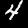

```{r setup, include=FALSE}
knitr::opts_chunk$set(echo = TRUE)
```

```{r}
# Imports as usual
library(keras)
```

Deep neural networks, or even shallow neural networks require a lot (thousands, hundred of thousands of exampels) of training data to achieve good results. What must one do if there is not enough data? Think of a data set of digits whereby the task is to develop a model that can recognise digits. Now think of a hand written number on paper, say number 3. Now image that same 3 rotated by a tiny bit, it still looks like a 3. In this tutorial we will cover simple data augmentation techniques that will result in a lot more data for training. Here are some examples of images that were generated automatically, what do you think of them? Do you think that having more images like this in a small dataset could add value?






```{r}
# Load Keras' MNIST data
mnist<- dataset_mnist()

# Read the training data
x_train <- mnist$train$x
y_train <- mnist$train$y

# Read the test data
x_test <- mnist$test$x
y_test <- mnist$test$y

# Convert the labels into their one-hot encoded equivalents
# MNIST has 10 classes
y_train_hot<-to_categorical(y_train,num_classes = 10)
y_test_hot<-to_categorical(y_test,num_classes=10) 
```

Just for now, let's only use a small subset of the data by selecting 10 examples from the data.Since MNIST is greyscale, we need to add a "1" to the number of channels. If it were a colour dataset then the colour channel would be a "3" instead. In order to use the built in data augmentation function, our data has to be of rank 4 (i.e. 4 dimensions). (number of examples, width, height, channels)


```{r}
x_train_small <- x_train[1:10,,]
```

Take a look at the dimensions of our sampled dataset


```{r}
dim(x_train_small)
```

MNIST is already by default in (60000, 28,28) but you can see that it is missing one more dimension
and we fix this below.


```{r}
dim(x_train_small) <- c(nrow(x_train_small), 28, 28, 1) 
dim(x_train_small)
```

Can you notice the difference between the dimension before and after?


```{r}
# Select a subset of training labels
y_train_small <- y_train_hot[1:10,]
```


```{r}
# Select a subset of test examples
x_test_small <- x_test[1:10,,]

# Add greyscale channel value of 1
dim(x_test_small) <- c(nrow(x_test_small), 28, 28, 1) 

# Check dimensions
dim(x_test_small)

# Select a subset of test labels
y_test_small <- y_test_hot[1:10,]

# Check dimensions
dim(y_test_small)
```

Build a neural network model. In this case a CNN for MNIST so the input shape must be 28,28,1 (1 for greyscale).


```{r}
# Define a sequential model
model<-keras_model_sequential()

# Create the network architecture
model %>%
  layer_conv_2d(filters = 32,                      # number of convolution filters in conv layer 1
                kernel_size = c(3,3),              # use 3 x 3 convolution filter in conv layer 1
                input_shape = c(28, 28, 1)) %>%    # shape of input data
  layer_activation('relu') %>%                     # activation function in conv layer 1
  layer_dropout(rate = 0.20) %>%                   # apply 20% dropout after conv layer 1
  layer_conv_2d(filters = 64,                      # number of convolution filters in conv layer 2
                kernel_size = c(3,3)) %>%          # also use 3 x 3 filter in conv layer 2
  layer_activation('relu') %>%                     # activation function in conv layer 2
  layer_max_pooling_2d(pool_size = c(2, 2)) %>%    # apply max pooling after conv layer 2
  layer_flatten() %>%                              # flatten output into a vector
  layer_dense(units = 10, activation = 'softmax')  # fully connected to output layer
```

## Compile the model


```{r}
model %>% compile(
  loss = 'categorical_crossentropy',
  optimizer = 'rmsprop',
  metrics = c('accuracy')
)
```

## Create data generator

Here we use the image_data_generator() function to create additional images. This function can flip, shift and rotate images. Read more here https://tensorflow.rstudio.com/keras/reference/image_data_generator.html In this dataset, should horizontal_flip be set to TRUE or FALSE?


```{r}
gen_images <- image_data_generator(featurewise_center = TRUE,
                                   featurewise_std_normalization = TRUE,
                                   rotation_range = 10,
                                   width_shift_range = 0.30,
                                   height_shift_range = 0.30,
                                   horizontal_flip = FALSE  )
```

Here we take some images from the dataset and use this to fit some parameters in the image generator


```{r}
gen_images %>% fit_image_data_generator(x_train_small)
```

With the following snippet of code, we can generate some images and then save those images to the hard drive. Note that the code uses gen_images which we defined just above. The batch size represents the number of images which will be generated, in this case, 9.


```{r}
images_iter <- flow_images_from_data(
  x=x_train_small, y=y_train_small,
  generator=gen_images,
  batch_size=9,
  save_to_dir='data/Images/',  # you need to make this folder if doesn't already exist
  save_prefix="aug",
  save_format="jpeg"
)
```

We're now ready to generate images and the model together. 


```{r}
model %>% fit_generator(
  images_iter,
  steps_per_epoch=1, epochs = 1,
  validation_data = list(x_test_small, y_test_small) )
```

## Evaluate the model

Here we evaluate on the test set. To be correct, we should evaluate on the validation set and then once happy with the results apply the best model to the test set.


```{r}
model %>% evaluate(x_test_small, y_test_small, batch_size=32, verbose = 1)
```

What do these results mean? Nice explanation online: https://stackoverflow.com/questions/34518656/how-to-interpret-loss-and-accuracy-for-a-machine-learning-model

Of course the results are bad because we used a tiny subset of the data. Try use the whole MNIST training data with a large batch size for the image generator and see how the results change. Is there an improvement?

## --------------------------------------------------------

## This is the start of the second part.
## Data augmentation on structured folder data
It's possible to start directly from this point and skip everything above. <b> In which case, remember to import keras! </b>

This tutorial assumes that you can load your data directly and easily into x_train, y_train, x_test and y_test. Sometimes this isn't the case if preprocessing steps are hard. One way to overcome this is to organise your images into folders in your hard drive and to use a slight variation in the code.


Now let's apply data augmentation to an invasive species image dataset. Data source: https://www.kaggle.com/c/invasive-species-monitoring/data and also see some of the code [here](https://www.kaggle.com/ogurtsov/0-99-with-r-and-keras-inception-v3-fine-tune).


```{r}
# Specify the folder locations for the training, validation and test data
train_directory <- "data/invasives/sample/train/"
validation_directory <- "data/invasives/sample/validation/"
test_directory <- "data/invasives/sample/test/"

# once you are satisfied the code is working, run full dataset. Remove the # symbols to uncomment the code
# train_directory <- "data/invasives/train/"
# validation_directory <- "data/invasives/validation/"
# test_directory <- "data/invasives/test/"
```

And work out how many images we have.


```{r}
# Count the training examples
train_samples <- length(list.files(paste(train_directory,"invasive",sep=""))) +
    length(list.files(paste(train_directory,"non_invasive",sep="")))

# Count the validation examples
validation_samples <- length(list.files(paste(validation_directory,"invasive",sep=""))) +
    length(list.files(paste(validation_directory,"non_invasive",sep="")))

# Count the test examples
test_samples <- length(list.files(paste(test_directory,"invasive",sep=""))) +
    length(list.files(paste(test_directory,"non_invasive",sep="")))

train_samples
validation_samples
test_samples
```

Specify the image dimension and batch size. We need to specify this so that we can generate new images


```{r}
img_height <- 224
img_width <- 224
batch_size <- 1
```

## Data generator
Here we define the data generator. We choose a small rotation and no horizontal flipping


```{r}
datagen_invasive <- image_data_generator(featurewise_center = TRUE,
    rotation_range = 1,
    width_shift_range = 0.05,
    height_shift_range = 0.05,
    horizontal_flip = FALSE
  )
```

## Train/validation/test generators

Below is the code on how to train the model on the invasive species data. We will create another generator so as not to keep saving images to the disk. If we use the one above, "train_generator_invasive" we will end up saving a lot of images to disk


```{r}
train_generator_invasive <- flow_images_from_directory(
    train_directory, 
    generator = datagen_invasive,
    target_size = c(img_height, img_width),
    color_mode = "rgb",
    class_mode = "binary", 
    classes = c('non_invasive', 'invasive'),
    batch_size = batch_size,
    shuffle = TRUE,
    seed = 123)
```

We also need a validation generator


```{r}
validation_generator <- flow_images_from_directory(
    validation_directory, 
    generator = datagen_invasive,
    target_size = c(img_height, img_width),
    color_mode = "rgb",
    class_mode = "binary", 
    batch_size = batch_size, 
    shuffle = TRUE,
    seed = 123)
```

And also a test generator


```{r}
test_generator <- flow_images_from_directory(
  test_directory, 
  generator = image_data_generator(),
  target_size = c(img_height, img_width), 
  color_mode = "rgb", 
  class_mode = "binary", 
  batch_size = 1,
  shuffle = FALSE)
```

## Define the model


```{r}
model<-keras_model_sequential()

model %>%
  layer_conv_2d(filters = 32,                      # number of convolution filters in conv layer 1
                kernel_size = c(3,3),              # use 3 x 3 convolution filter in conv layer 1
                input_shape = c(img_height, img_width, 3)) %>%    # shape of input data
  layer_activation('relu') %>%                     # activation function in conv layer 1
  layer_dropout(rate = 0.20) %>%                   # apply 20% dropout after conv layer 1
  layer_max_pooling_2d(pool_size = c(2, 2)) %>%    # apply max pooling after conv layer 2
  layer_flatten() %>%                              # flatten output into a vector
  layer_dense(units = 64, activation = "relu") %>% 
  layer_dense(units = 1, activation = "sigmoid")
```

Print out a summary of the network


```{r}
summary(model)
```

## Compile the model


```{r}
model %>% compile(
  loss = "binary_crossentropy",
  optimizer = optimizer_sgd(lr = 0.0001, 
                            momentum = 0.9, 
                            decay = 1e-5),
  metrics = "accuracy"
)
```

## Train the model


```{r}
model %>% fit_generator(
  train_generator_invasive,
  steps_per_epoch = 1, 
  epochs = 1,
  validation_data = validation_generator,
  validation_steps = 1,
  verbose = 1)
```

## Test the model


```{r}
model %>% evaluate_generator(
    test_generator,
    steps = test_samples)
```

In summary:

Read in the data.

Create a data generator and specify the rotation, flipping parameters.

If you are using data which are already in the x and y variables then use the flow_images_from_data() like in the first example on MNIST.

Otherwise, if you're using a structured folder, use flow_images_from_directory() like in the invasive species dataset. In this case also remember to create a generator for the validation and test data.
